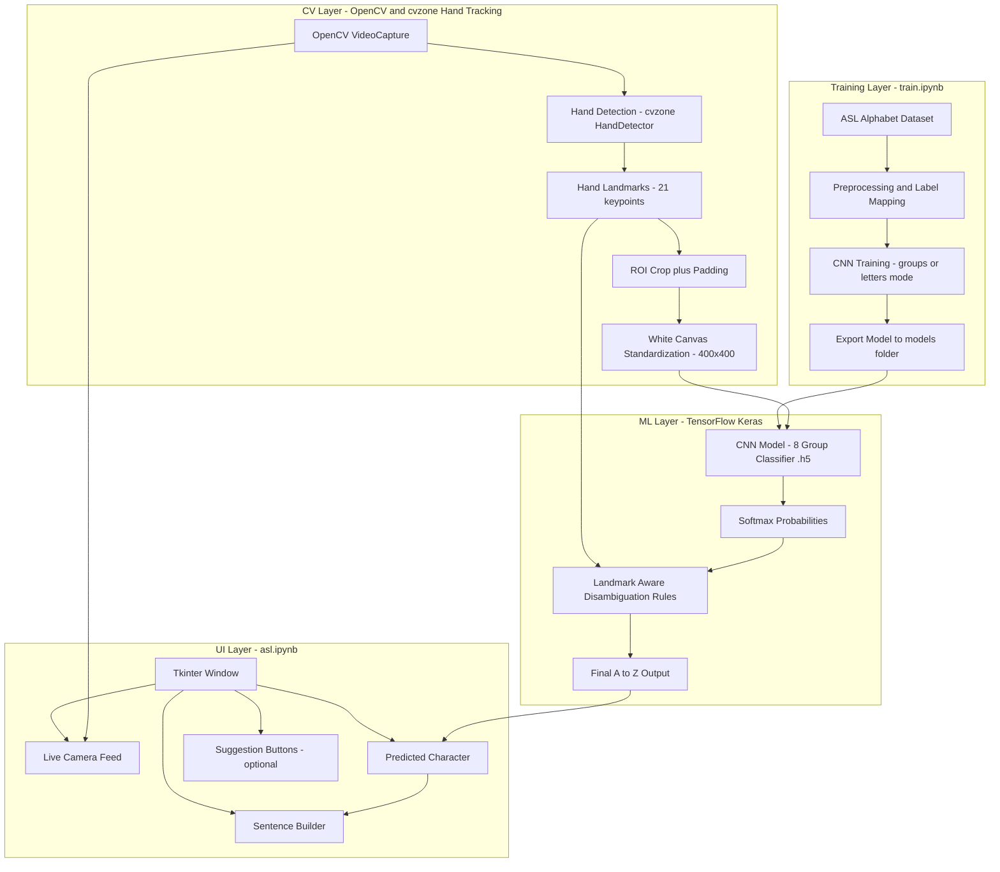
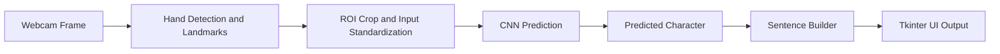

# ASL Gesture-to-Text System via Convolutional Neural Networks and Real-Time Hand Tracking Integration
**CSC173 Intelligent Systems Final Project**  
*Mindanao State University - Iligan Institute of Technology*  
**Student:** Joshua Radz T. Adlaon (2022-2534)  
**Semester:** AY 2025–2026 Sem 1  

[](https://python.org)
[](https://www.tensorflow.org/)
[](https://opencv.org)

*Figure 1. Real-time Tkinter application (from `asl.ipynb`) showing the webcam feed,
hand landmark overlay, an ASL reference panel, live character prediction, and a sentence builder.*

---

## Table of Contents
- [Abstract](#abstract)
- [Introduction](#introduction)
- [Related Work](#related-work)
- [Methodology](#methodology)
- [Experiments and Results](#experiments-and-results)
- [Discussion](#discussion)
- [Ethical Considerations](#ethical-considerations)
- [Conclusion](#conclusion)
- [Installation](#installation)
- [References](#references)

---

## Abstract
Automatic sign-to-text systems often succeed in controlled demonstrations but become unreliable in
real deployment because clean training conditions do not match webcam reality. In practice, the
video stream is affected by lighting shifts, motion blur, partial occlusion, camera distance changes,
and background clutter. These factors are especially problematic for **ASL finger-spelling**, where
letters may differ only by subtle finger positions and small viewpoint changes can flip predictions.
A deployable accessibility tool must therefore solve more than “classification accuracy” — it must
deliver stable predictions at interactive speed and provide clear user feedback.

This project implements an end-to-end, notebook-driven **ASL finger-spelling gesture-to-text**
system. It combines (1) a Convolutional Neural Network (CNN) trained on labeled ASL alphabet images,
(2) real-time hand tracking to extract structured cues and maintain consistent regions of interest,
and (3) a Tkinter application layer that translates recognized gestures into written text by
building characters into a sentence.

The repository is organized into two Jupyter notebooks:
- `train.ipynb` trains and exports the CNN model into `models/`
- `asl.ipynb` runs the real-time application: webcam capture, hand tracking, inference, and UI output

**Scope:** The system targets **static ASL alphabet gestures (A–Z)** and translates them into written
text in real time.

---

## Introduction
ASL is a complete language used by Deaf communities, and finger-spelling is a core part of ASL
communication — commonly used for names, acronyms, and words without dedicated signs. However,
many non-signers cannot interpret ASL, which creates barriers in classrooms, workplaces,
customer service settings, and everyday public interactions. A real-time gesture-to-text tool can
help bridge this gap by providing immediate written output for recognized gestures, supporting more
inclusive communication between Deaf and hearing individuals.

From a computer vision standpoint, finger-spelling recognition is challenging because a model must
separate meaningful hand shape information from irrelevant variation. In real webcam use, the same
gesture can appear different due to camera angle, distance, hand size, lighting, and background.
Furthermore, several letters are inherently visually similar, meaning correct recognition requires
stable hand detection and consistent input representations. A practical system must be **responsive**,
**stable**, and **debuggable**, not only accurate on a dataset split.

### Problem Statement
Automatic ASL gesture-to-text systems face significant deployment barriers because the operating
conditions of real users are fundamentally different from the controlled conditions under which
many recognition models are trained. Publicly available ASL datasets typically contain clean,
centered images of hands with consistent framing and limited environmental noise. When a model
trained under these conditions is deployed in a real webcam setting, it is exposed to a wide range
of disturbances: uneven lighting, shadows, cluttered backgrounds, motion blur from natural hand
movement, partial occlusion (e.g., fingers leaving the frame), and variability in camera placement
and hand articulation across users.

This mismatch produces failure modes that directly reduce usability. Predictions can “jitter”
between multiple letters across consecutive frames, even when the user holds the same gesture.
Visually similar letters (such as pairs and clusters that differ by a single finger bend or thumb
position) are particularly vulnerable: small shifts in the region of interest, slight landmark
tracking instability, or minor changes in viewpoint can cause the model to alternate between
confusable outputs. In an accessibility application, these errors are not minor — they compound
quickly when building words and sentences, leading to output that is confusing or unusable.

Many prototype solutions attempt to compensate by adding heavy preprocessing and heuristic filters.
While these can improve recognition in a narrow environment, they often introduce new problems:
increased latency, brittle parameter tuning, and reduced interpretability when debugging failures.
At the same time, collecting large-scale, diverse real-world webcam data is expensive and raises
privacy concerns, limiting the ability to “solve deployment” purely by gathering more data.

Therefore, a deployable ASL gesture-to-text system must:
1) maintain fast and stable inference for interactive use,
2) reduce sensitivity to background and lighting variations,
3) handle visually confusable letters more carefully than a naive classifier,
4) remain interpretable so failures can be diagnosed, and
5) support an iterative training workflow so the model can be updated as new labeled samples become
   available.

### Objectives
This project addresses the above problem through the following objectives:

1. **Build a deployable real-time user experience**
   - Develop a Tkinter interface that clearly displays webcam input, predicted output, and the
     evolving translated sentence.
   - Provide usability controls (clear/reset) and feedback elements (prediction display, suggestion
     buttons when available).

2. **Reduce deployment brittleness via structured hand tracking**
   - Integrate real-time hand tracking to stabilize the region of interest around the hand.
   - Use landmarks as structured cues to keep the pipeline less dependent on background textures.

3. **Train a CNN aligned with real-time inference constraints**
   - Train a CNN on a large labeled dataset of ASL alphabet gestures.
   - Export a lightweight model that can be loaded and executed continuously inside a webcam loop.

4. **Handle visually confusable letters more robustly**
   - Use post-processing logic based on landmark geometry to disambiguate letters that are easily
     confused by a coarse classifier.
   - Reduce prediction jitter by applying decision logic that uses both model confidence and hand
     pose structure.

5. **Provide a reproducible training-to-deployment workflow**
   - Separate training (`train.ipynb`) from deployment (`asl.ipynb`) while keeping preprocessing
     assumptions aligned.
   - Enable repeatable model updates and rapid experimentation.

6. **Enable evaluation and reporting**
   - Provide clear metrics and artifacts that explain model behavior (training curves, confusion
     patterns, and real-time behavior observations).

---

## Related Work
Research on ASL recognition spans computer vision, gesture understanding, and human–computer
interaction. Prior work can be grouped into several categories relevant to this project.

### 1) CNN classification on full RGB images
A common baseline approach is to train a CNN directly on RGB images of hand signs. CNNs are well
suited for learning hierarchical spatial features, and they can achieve strong accuracy on curated
datasets. However, a key limitation is **distribution shift**: if the training images are clean and
centered but deployment frames contain clutter, shadows, and viewpoint changes, the CNN may learn
shortcuts (background correlation) or fail to generalize. Another limitation is interpretability:
when a prediction fails, it can be difficult to determine whether the cause is background noise,
cropping, blur, or genuine gesture similarity.

### 2) Classical hand segmentation and preprocessing pipelines
Earlier systems often rely on thresholding, skin-color segmentation, contour extraction, and
morphological operations to isolate the hand before classification. These pipelines can work in a
controlled environment but frequently require per-camera tuning and break under lighting changes.
They also increase latency and can reduce real-time responsiveness.

### 3) Landmark-based recognition (keypoint features)
Modern hand trackers (e.g., landmark detection models) provide a compact representation of hand pose
as a set of keypoints. Recognition can be performed using classical ML (SVM, k-NN, Random Forest) or
neural models on landmark vectors. Landmark representations reduce sensitivity to background and
often improve robustness, but success depends on tracking stability. Under motion blur, occlusion,
or extreme angles, landmarks can drift, producing recognition errors.

### 4) Hybrid approaches (landmarks + deep learning)
A strong practical strategy is to combine structured hand tracking with deep learning. Landmarks can
stabilize the region of interest and provide geometric cues, while a CNN can learn discriminative
visual features for classification. Hybrid approaches improve interpretability because developers
can visualize the tracking output and diagnose whether errors come from the tracker or from the
classifier.

### 5) Deployment-focused recognition (accuracy, stability, and UX)
For accessibility tools, “accuracy on a test split” is not the only requirement. Real deployment
needs low-latency inference, reduced prediction jitter over time, and clear user feedback. Systems
that include a real UI loop often reveal practical challenges (cropping errors, unstable tracking,
and user behavior differences) that are not visible in offline evaluation alone.

**Positioning of this project:** This repository focuses on an end-to-end pipeline that runs in real
time (webcam capture → hand tracking → CNN inference → text output) and supports retraining and
iteration through notebook-based experimentation.

---

## Methodology

### System Overview
This project is implemented through two notebooks:
- **Training Notebook:** `train.ipynb` (dataset loading, preprocessing, CNN training, model export)
- **Application Notebook:** `asl.ipynb` (webcam capture, hand tracking, inference, UI translation)

### Dataset Choice
The project uses the **American Sign Language Alphabet Dataset** from Kaggle, consisting of
approximately **87,000 labeled images** of static ASL alphabet gestures.

Dataset characteristics:
- **Classes:** 26 letters (A–Z)
- **Size:** ~87k images across all categories
- **Format:** RGB images with consistent gesture framing
- **Reason for choice:**
  - Large enough for CNN training
  - Balanced classes across alphabet letters
  - Suitable for static-gesture recognition tasks
  - Matches the project’s focus on letter-by-letter ASL prediction

> Note: Some versions of this Kaggle dataset also include extra folders such as SPACE/DELETE/NOTHING.
> This project’s core objective is A–Z finger-spelling; extra classes can be included or excluded
> depending on the training configuration.

### Preprocessing and Input Representation
The system processes inputs in two aligned forms:
1. **Visual input for CNN:** a standardized image representation (fixed resolution) used as the model
   input.
2. **Geometric cues for disambiguation:** hand landmarks from real-time tracking that help refine
   predictions for visually similar letters.

In the application notebook, the hand detector provides a stable ROI around the hand. The pipeline
also supports drawing a “standardized hand representation” onto a clean canvas (white background)
to reduce background dependence and improve consistency in real webcam use.

### Architecture (Implementation-Level Outline)
Below is the architecture described in the same “component outline” style as research projects,
but aligned to this repository’s CNN + hand tracking design.

**Architecture**
- **Base Model:** CNN Classifier (TensorFlow/Keras)
- **Training Input:** RGB images from Kaggle ASL Alphabet dataset (standardized to model resolution)
- **Deployment Input:** ROI-processed frames from webcam (standardized to match training input)

**Computer Vision Backbone**
- **Hand Tracking:** cvzone `HandDetector` (built on MediaPipe Hands)
- **Tracking Output:** 21 hand landmarks (keypoints) and a hand bounding box
- **ROI Processing:** crop around detected hand + padding → resize to model resolution

**Prediction Heads (Functional Blocks)**
- **CNN Classification Head:** predicts gesture class probabilities
- **Post-processing / Disambiguation Head:** rule-based refinement using landmark geometry
  (used to reduce confusion between visually similar letters when the coarse prediction is ambiguous)

**Custom Components (Project-Specific)**
- **Coarse-to-Fine Strategy (as implemented in `asl.ipynb`):**
  - The exported model can be trained either as:
    - **8-group classifier** (current app mode) then refined to a final letter using landmark rules, or
    - **26-letter classifier** (direct A–Z) when configured in `train.ipynb`
- **Text Translation Layer:**
  - Character buffer → word candidates → sentence builder
  - Optional dictionary-based suggestions (PyEnchant) when available

### System Architecture Diagram

### End-to-End Pipeline (Operational View)


### Training Procedure (`train.ipynb`)
1. **Dataset indexing:** read folders and labels from the dataset directory structure.
2. **Label strategy:**
   - **Letters mode:** direct A–Z classification (26 outputs).
   - **Groups mode:** grouped classes (8 outputs) used by the current application model to support
     coarse recognition and later refinement.
3. **Model training:** train CNN using a training/validation split.
4. **Model export:** save the trained `.h5` model into `models/` for use in the application.

### Real-Time Application Procedure (`asl.ipynb`)
1. Capture a frame from webcam (OpenCV).
2. Detect the hand and extract landmarks (cvzone/MediaPipe).
3. Crop the ROI around the hand, resize/standardize.
4. Run CNN inference and obtain probabilities.
5. Apply landmark-aware rules to refine the output when necessary.
6. Update the Tkinter UI: show predicted letter and append to the sentence builder.

---

## Experiments and Results

### Metrics Outline
To evaluate both offline recognition performance and real-time usability, the following metrics are
recommended and supported by the project workflow:

**Offline classification metrics (from `train.ipynb`)**
- **Accuracy:** overall correct predictions on validation/test data
- **Precision / Recall / F1-score (macro and per-class):** useful when some letters are harder
- **Top-k Accuracy (Top-2 / Top-3):** important for visually similar letters
- **Confusion Matrix:** highlights specific confusable pairs (the most practical evaluation tool)

**Real-time system metrics (from `asl.ipynb`)**
- **Inference Latency:** time per prediction (ms)
- **FPS (Frames per Second):** end-to-end responsiveness
- **Stability / Jitter Rate:** how often the prediction changes while the gesture is held steady
- **End-to-End UI Responsiveness:** perceived lag during sentence building

> In a deployment-oriented system, stability and latency are often as important as accuracy.

### Demo


https://github.com/user-attachments/assets/616565d7-7b8d-40ba-9139-509e943ece5e


---

## Discussion
This project demonstrates that building a deployable ASL gesture-to-text system requires more than
training a classifier. The main success of the repository is the **complete loop** from model
training to a working real-time UI, which exposes real-world constraints that purely offline
experiments often miss.

### What worked well
1. **Real-time integration reveals practical issues early.** By running inference inside a UI loop,
   the system makes it easy to observe jitter, ROI errors, and tracking instability — issues that
   are otherwise hidden in notebook-only evaluation.
2. **Hand tracking improves robustness.** Even when using a CNN, stabilizing the ROI around the hand
   reduces background dependence and makes the model input more consistent.
3. **Coarse-to-fine refinement improves usability.** The project’s landmark-aware post-processing is
   valuable for dealing with visually similar letters. A pure classifier may be correct on average
   but still produce unstable outputs frame-to-frame. Refinement helps improve stability.
4. **Notebook separation supports iteration.** Keeping training and deployment in separate notebooks
   makes it straightforward to retrain the model and test changes without rewriting the UI.

### Key limitations
1. **Static finger-spelling only.** The current scope targets static gestures (A–Z). Continuous sign
   language translation (words and sentences) would require temporal modeling and a richer dataset.
2. **Generalization depends on data diversity.** Even with 87k images, deployment performance can
   drop if webcam conditions differ significantly from dataset conditions.
3. **Confusable letters remain challenging.** Some letters are inherently similar and may require
   additional cues (multi-view training, temporal smoothing, or higher-quality landmark features).

### Recommended improvements 
1. **Temporal smoothing for stability**
   - Majority voting over the last N frames
   - Confidence thresholds before appending a character to the sentence builder
2. **Data augmentation aligned to deployment**
   - Random brightness, blur, rotation, and background variation
3. **Quantitative reporting**
   - Confusion matrix visualization for A–Z
   - Per-class F1 analysis to identify weak letters
4. **Extending the vocabulary**
   - Add SPACE/DELETE/NOTHING as explicit classes (if using them in UI)
   - Expand beyond alphabet to common words/gestures using sequence models
5. **User-centered evaluation**
   - Test with different users, camera devices, and environments
   - Document qualitative feedback about speed, stability, and readability

## Ethical Considerations
- **Privacy:** Webcam input can capture faces, backgrounds, and personal information. The system
  should run locally and avoid storing frames or recordings without explicit consent.
- **Fairness and accessibility:** Performance may vary across users due to different hand shapes,
  skin tones, lighting conditions, and camera quality. More diverse training data and testing is
  needed to reduce disparities.
- **Misclassification risk:** Output is probabilistic and may be incorrect. The system should be
  treated as an assistive tool and not be relied on for high-stakes communication without human
  confirmation.
- **Responsible communication:** Project documentation should clearly state limitations and avoid
  over-claiming “full ASL translation” when the scope is finger-spelling.


## Conclusion
This repository delivers a complete **ASL finger-spelling gesture-to-text system** built with a CNN
classifier and real-time hand tracking integration. It includes a reproducible training pipeline
(`train.ipynb`) and a deployable application pipeline (`asl.ipynb`) that runs live webcam inference
and translates predictions into written text using a sentence builder UI. By combining deep learning
with structured hand tracking and landmark-aware post-processing, the project directly addresses
deployment challenges such as input instability, confusable letters, and real-time usability.

---

## Installation

### Requirements
Install dependencies (recommended inside a virtual environment):

```bash
pip install -r requirements.txt
```

Typical dependencies include:
- TensorFlow / Keras
- OpenCV
- cvzone (MediaPipe-based hand tracking)
- NumPy
- Pillow (PIL)
- Matplotlib, pandas, scikit-learn (training and plots)
- PyEnchant (optional suggestions; OS dictionary-dependent)
- Tkinter (usually included with Python)

### Run Instructions
1. **Train or update the model:** open `train.ipynb` and run all cells to export a model into `models/`.
2. **Run the application:** open `asl.ipynb` and run cells top-to-bottom. The final cell launches Tkinter.

## References
## References
[1] Fierro Radilla, A.N., Perez-Daniel, K.R. "Siamese Convolutional Neural Network for ASL Alphabet Recognition," *Computacion y Sistemas*, vol. 24, no. 3, 2020. DOI: 10.13053/CYS-24-3-3481.<br>
[2] Kozyra, K., Trzyniec, K., Popardowski, E., Stachurska, M. "Application for Recognizing Sign Language Gestures Based on an Artificial Neural Network," *Sensors*, vol. 22, no. 24, 9864, 2022. DOI: 10.3390/s22249864.<br>
[3] Ojha, A., Pandey, A., Maurya, S., Thakur, A., Dayananda, P. "Sign Language to Text and Speech Translation in Real Time Using Convolutional Neural Network," *International Journal of Engineering Research & Technology (IJERT)*, NCAIT, vol. 8, issue 15, 2020. DOI: 10.17577/IJERTCONV8IS15042.<br>
[4] Nahapetyan, V.E. "ASL Fingerspelling Recognition," *Discrete and Continuous Models and Applied Computational Science*, no. 2, pp. 105-113, 2013.<br>
[5] Patil, V.K., Pawar, V.R., Patil, A., Bairagi, V. "Sign language emotion and alphabet recognition with hand gestures using convolution neural network," *IAES International Journal of Artificial Intelligence (IJ-AI)*, vol. 14, no. 2, pp. 954-962, 2025. DOI: 10.11591/ijai.v14.i2.pp954-962.<br>
[6] Rastgoo, R., Kiani, K., Escalera, S. "Sign Language Recognition: A Deep Survey," *Expert Systems with Applications*, vol. 164, 113794, 2021. DOI: 10.1016/j.eswa.2020.113794.<br>
[7] Papastratis, I., Chatzikonstantinou, C., Konstantinidis, D., Dimitropoulos, K., Daras, P. "Artificial Intelligence Technologies for Sign Language," *Sensors*, vol. 21, no. 17, 5843, 2021. DOI: 10.3390/s21175843.<br>
[8] Adaloglou, N., Chatzis, T., Papastratis, I., Stergioulas, A., Papadopoulos, G.T., Zacharopoulou, V., Xydopoulos, G.J., Atzakas, K., Papazachariou, D., Daras, P. "A Comprehensive Study on Deep Learning-Based Methods for Sign Language Recognition," *IEEE Transactions on Multimedia*, vol. 24, pp. 1750-1762, 2022. DOI: 10.1109/TMM.2021.3070438.<br>
[9] Jiang, X., Satapathy, S.C., Yang, L., et al. "A Survey on Artificial Intelligence in Chinese Sign Language Recognition," *Arabian Journal for Science and Engineering*, vol. 45, pp. 9859-9894, 2020. DOI: 10.1007/s13369-020-04758-2.<br>
[10] Kaggle. "American Sign Language Alphabet Dataset (grassknoted)." Available: https://www.kaggle.com/datasets/grassknoted/asl-alphabet<br>
