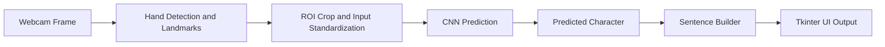

# Real-Time ASL Finger-Spelling Gesture-to-Text System via CNNs and Hand Tracking Integration
**CSC173 Intelligent Systems Final Project**  
*Mindanao State University - Iligan Institute of Technology*  
**Student:** Joshua Radz T. Adlaon, 2022-2534
**Semester:** AY 2025-2026 Sem 1  
[](https://python.org) [](https://pytorch.org)
**Deep Learning + Computer Vision (CNN + Hand Landmarks) | Jupyter Notebooks + Tkinter UI**


*Figure 1. Real-time Tkinter application (from `asl.ipynb`) showing the webcam feed,
hand landmark overlay, ASL reference panel, live character prediction, and a sentence builder.*

---

## Abstract
Automatic ASL (American Sign Language) gesture-to-text systems often succeed in controlled demos
but degrade in real deployment because clean training conditions do not match webcam reality.
In practice, the input stream includes lighting shifts, cluttered backgrounds, motion blur,
partial occlusion, and user-to-user differences in hand shape and signing style.
These factors can produce unstable predictions, especially for ASL finger-spelling,
where many letters differ only by subtle finger positions.

This project implements an end-to-end, notebook-driven ASL finger-spelling recognition system built
around a Convolutional Neural Network (CNN) for gesture classification and a real-time application
layer that translates predictions into written text.

The system includes:
1. A webcam-based user interface (Tkinter)
2. An image processing and feature extraction module
   (OpenCV capture and cvzone/MediaPipe hand detection with landmarks)
3. A deep learning inference module (TensorFlow/Keras CNN)

A structured ASL sign library (dataset organized by gesture label folders) supports training.
The training notebook is designed to be rerun as new data is added so the exported model can be
updated without rebuilding the application.

**Scope:** This implementation focuses on ASL finger-spelling (A–Z) and produces written text by
predicting characters and building a sentence in real time.

## Table of Contents
- [Introduction](#introduction)
- [Related Work](#related-work)
- [Methodology](#methodology)
- [Experiments & Results](#experiments--results)
- [Discussion](#discussion)
- [Ethical Considerations](#ethical-considerations)
- [Conclusion](#conclusion)
- [Installation](#installation)
- [References](#references)

## Introduction
ASL is a complete language used by Deaf communities, and finger-spelling is commonly used for names,
acronyms, and terms without a dedicated sign. Many hearing individuals and non-signers do not
understand ASL, which can create barriers in classrooms, workplaces, customer service settings,
and public spaces. A real-time ASL gesture-to-text tool can improve accessibility by providing
immediate written output for recognized gestures, supporting smoother communication between Deaf
and hearing individuals.

From a computer vision perspective, ASL recognition is not just “image classification.”
In real webcam use, the system must be responsive, stable, and robust to environment changes.
Finger-spelling adds difficulty because classes can be visually similar, and small errors in feature
extraction can flip predictions. This makes deployment reliability and stability just as important
as raw accuracy on a curated dataset split.

### Problem Statement
Automatic ASL gesture-to-text systems face significant deployment barriers in real-world webcam
environments due to the mismatch between generic training data and operational reality.
Standard CNN-based approaches trained on clean images can fail when confronted with everyday capture
conditions such as lighting variation, cluttered backgrounds, motion blur, oblique viewing angles,
and occlusions. These conditions are not rare edge cases; they represent typical usage for
accessibility tools.

This mismatch creates a bottleneck for real-time applications. To compensate, many systems rely on
extensive preprocessing and heuristic stabilization pipelines, which can increase latency,
complicate maintenance, and reduce interpretability. Additionally, collecting large-scale, diverse
ASL datasets is difficult due to labeling cost and privacy considerations around video capture,
limiting the model’s ability to generalize across users and environments.

Therefore, a deployable ASL gesture-to-text system must reduce dependence on background appearance,
provide stable real-time inference, remain interpretable for debugging, and support an iterative
training workflow so the model can be updated as new labeled data becomes available.

### Objectives
This project addresses the problem statement through the following objectives:

1. **Deployable real-time user experience**
   - Build a webcam-based UI that shows live capture, model outputs, and a readable text translation
     pathway (character to sentence).
   - Provide interactive controls for demonstration and testing (clear/reset and visible feedback;
     optional suggestions if supported).

2. **Robust feature extraction under webcam noise**
   - Detect and isolate the hand region reliably using a region of interest (ROI) and padding to
     preserve fingertip geometry.
   - Extract structured features (hand landmarks and normalized representations) that reduce
     sensitivity to background and lighting.

3. **CNN gesture recognition aligned with deployment**
   - Train a CNN that learns gesture patterns and can be deployed directly for real-time inference.
   - Keep training preprocessing aligned with application preprocessing to minimize train–deploy
     mismatch.

4. **Maintain a structured ASL sign library**
   - Organize the dataset as a label-indexed repository (A–Z folder structure) that functions as a
     practical “sign database.”
   - Maintain explicit mapping from gesture class to text label for reproducibility.

5. **Support continuous improvement and model updates**
   - Provide a training notebook (`train.ipynb`) that can be rerun as new data is added (retraining
     or fine-tuning).
   - Export updated models into `models/` so the application notebook (`asl.ipynb`) can load the
     latest version.

6. **Improve interpretability and debuggability**
   - Provide visual evidence of system behavior (landmark overlays and consistent input
     representation).
   - Enable clear diagnosis of failure modes such as unstable landmarks, poor ROI crops, or
     ambiguous hand poses.

7. **Enable evaluation-friendly experimentation**
   - Make it straightforward to add quantitative evaluation such as confusion matrices and
     per-class metrics.
   - Make it straightforward to add real-time performance checks such as FPS and latency tracking.

---

## Repository Contents
This repository is implemented as two connected notebooks:

- **`train.ipynb` — Training Module**
  - Dataset loading and label handling
  - Preprocessing and input pipeline
  - CNN training and export to `models/`

- **`asl.ipynb` — Application Module**
  - Webcam capture (OpenCV)
  - Hand detection and landmark-based feature extraction (cvzone/MediaPipe)
  - CNN inference in real time
  - Text translation output via Tkinter UI (Figure 1)

---

## Related Work
ASL recognition sits at the intersection of hand pose estimation, gesture recognition, and real-time
human–computer interaction. Existing approaches commonly fall into these categories:

### Raw RGB classification (CNN on full frames)
A common baseline is to train a CNN directly on RGB frames. While effective in controlled
conditions or with very large diverse datasets, this approach can learn shortcuts from background
textures and lighting rather than hand geometry. It also tends to generalize poorly when the
deployment environment differs from training, and it can be harder to debug because failure causes
are not visually obvious.

### Classical preprocessing pipelines (thresholding and segmentation)
Some systems depend on thresholding, contour extraction, background subtraction, and morphological
operations to isolate the hand before classification. These pipelines can help early prototypes but
often require extensive parameter tuning per environment, become brittle under lighting changes and
camera noise, and increase latency in real-time use.

### Landmark or keypoint-based recognition
Modern hand trackers output a compact geometric representation (for example, 21 hand landmarks).
Recognition can then be performed with classical ML models over landmark features (SVM, k-NN,
Random Forest), sequence models over landmark trajectories for dynamic gestures (LSTM, GRU,
Transformers), or hybrid approaches that combine learned models with simple rules for disambiguation.
Landmark-based methods improve background invariance, but performance depends heavily on tracking
stability under blur, occlusion, and unusual viewpoints.

### Hybrid pipelines (structured features plus deep learning)
Hybrid systems combine the strengths of landmarks and deep learning by normalizing the input
(landmark vectors or synthesized skeleton representations) and training a neural classifier on that
structured input. This typically improves robustness and interpretability while keeping inference
efficient.

### Deployment-focused recognition (accuracy plus stability plus UX)
For accessibility tools, a usable system must deliver low-latency feedback, stable predictions
(reduced jitter), clear UI feedback, and an update path as more data is collected. Many prototypes
stop at reporting accuracy and do not address the complete deployed loop (capture, processing,
inference, UI behavior, and text-building logic).

**Positioning of this project:** This repository emphasizes a complete deployed loop—training and
real-time application—supported by structured feature extraction and a retraining workflow.

---

## Methodology

### Architecture (High-Level)
```mermaid
flowchart TB
  subgraph UI[User Interface Layer]
    U0[Tkinter Window]
    U1[Live Camera Panel]
    U2[Character Output]
    U3[Sentence Builder]
    U4[Optional Suggestions]
  end

  subgraph CV[Computer Vision Layer]
    C1[OpenCV Webcam Capture]
    C2[Hand Detection]
    C3[Landmark Extraction]
    C4[ROI Crop and Standardization]
  end

  subgraph ML[Machine Learning Layer]
    M1[CNN Model (TensorFlow/Keras)]
    M2[Prediction Output]
  end

  subgraph DATA[Data and Training Layer]
    D1[ASL Sign Library: A–Z folders]
    D2[train.ipynb Training Pipeline]
    D3[Exported Model (.h5) in models/]
  end

  C1 --> C2 --> C3 --> C4 --> M1 --> M2 --> U2 --> U3
  C1 --> U1
  U0 --> U1
  U0 --> U2
  U0 --> U3
  U0 --> U4

  D1 --> D2 --> D3 --> M1
```

### End-to-End Pipeline (Operational View)


### Dataset / ASL Sign Library
The training notebook expects a dataset organized by folders:

```text
dataset/
  AtoZ_3.1/
    A/
    B/
    C/
    (continue through Z/)
```

Each folder contains images representing the corresponding finger-spelling letter.
This directory structure functions as the project’s sign library by defining the mapping from
gesture class to text label during training.

### Image Processing and Feature Extraction (`asl.ipynb`)
For each webcam frame, the application performs:
1. Frame capture using OpenCV
2. Hand detection and landmark extraction (cvzone/MediaPipe-based)
3. ROI cropping around the hand (with padding to preserve full finger shape)
4. Input standardization to match the trained model format
5. CNN inference and UI update

This stage is critical for stability: many real-time failures come from poor ROI placement, unstable
landmarks, or distribution shift between training and live capture.

### CNN Training Workflow (`train.ipynb`)
The training notebook typically:
- indexes image paths and labels,
- splits the data into training and validation sets,
- trains a CNN using TensorFlow/Keras,
- exports the trained model into `models/` for deployment.

### Real-Time Inference and Text Translation (`asl.ipynb`)
The application notebook loads the exported model and continuously:
- predicts a character label from live input,
- updates the character display,
- appends predictions into a sentence string for written output,
- provides clear/reset controls and optional suggestions where available.

---

## Experiments and Results

### Experiment 1 — Training Behavior (`train.ipynb`)
**Goal:** Verify that the CNN learns meaningful gesture patterns from the labeled dataset.

**Evidence produced in the notebook:**
- training and validation accuracy and loss curves,
- exported model file saved into `models/`.

**Interpretation:**
- rising validation accuracy suggests generalization,
- validation loss rising while training loss falls suggests overfitting and motivates augmentation or
  more diverse data.

Note: This README does not claim a fixed accuracy score because results depend on dataset size, split
strategy, random seed, and the specific training run.

### Experiment 2 — End-to-End Real-Time Demo (`asl.ipynb`)
**Goal:** Validate the complete pipeline in real time (capture, detection, preprocessing, inference,
and UI output).

**Qualitative evidence (Figure 1):**
- landmarks are detected and displayed correctly,
- a character prediction is produced live,
- the sentence builder updates continuously in the UI.

For real-time recognition, strong results include prediction stability when the gesture is held
steady, smooth UI updates, and low perceived latency.

---

## Discussion
This project is designed for deployability and interpretability, not only for offline accuracy.

**Strengths**
- Clear training-to-deployment workflow (two-notebook design)
- Structured feature extraction improves robustness to background and lighting changes
- A working UI makes the system easy to demonstrate, test, and debug

**Challenges and failure modes**
- visually similar letters can be confused without sufficient data diversity
- motion blur and occlusion can reduce landmark reliability
- dataset mismatch (camera distance and angle) can reduce generalization

**Recommended improvements**
- data augmentation during training (scale, rotation, blur, brightness variation)
- temporal smoothing (majority vote across recent frames) to reduce jitter
- confusion matrix and per-class analysis to target weak letters
- broader data collection across multiple users and environments

---

## Ethical Considerations
- **Privacy:** Webcam input can capture sensitive information. Process frames locally and avoid
  storing images or videos without explicit consent.
- **Fairness:** Performance can vary across users and environments. Diverse training data is
  necessary to reduce disparities.
- **Misclassification risk:** Output is probabilistic and may be wrong. Treat this as an assistive
  prototype and communicate limitations clearly.
- **Responsible deployment:** Do not rely on this system for high-stakes communication without
  human verification.

---

## Conclusion
This repository delivers a complete ASL finger-spelling gesture-to-text system that combines
computer vision feature extraction, CNN-based recognition, and a real-time Tkinter application
interface. By structuring the project into a training notebook and a deployment notebook, it
supports reproducible experimentation and continuous improvement as new labeled data becomes
available. The design emphasizes practical deployment concerns such as stability, responsiveness,
and interpretability, making it a strong foundation for future work such as temporal smoothing,
broader sign vocabularies, and more robust evaluation.

---

## Installation

### Requirements
Install dependencies (recommended inside a virtual environment):

```bash
pip install -r requirements_asl_env.txt
```

Typical dependencies include:
- TensorFlow / Keras
- OpenCV
- cvzone (MediaPipe-based hand tracking)
- NumPy
- Pillow (PIL)
- Matplotlib, pandas, scikit-learn (training and plots)
- PyEnchant (optional suggestions; OS dictionary-dependent)
- Tkinter (usually included with Python)

---

## How to Run

### 1) Train or Update the Model (`train.ipynb`)
1. Place the dataset in `dataset/AtoZ_3.1/` with folders `A/` to `Z/`.
2. Open `train.ipynb` and run all cells.
3. Confirm the trained model is exported under `models/` (the `.h5` file used by the application).

### 2) Run the Real-Time Application (`asl.ipynb`)
1. Ensure the trained model exists under `models/`.
2. (Optional) Place an ASL reference chart image at `assets/asl.jpg`.
3. Open `asl.ipynb` and run cells top-to-bottom.
4. The final cell launches the Tkinter window.

---

## Project Structure
```text
.
├─ asl.ipynb
├─ train.ipynb
├─ README.md
├─ assets/
│  ├─ app_ui_screenshot.png
│  ├─ asl.jpg                 # optional UI reference chart
│  └─ white.jpg               # generated if missing (canvas/reference)
├─ models/
│  └─ (trained model files, .h5)
└─ dataset/
   └─ AtoZ_3.1/
      └─ (folders A through Z)
```

---

## References
1. OpenCV — Computer Vision Library: https://opencv.org/
2. TensorFlow / Keras: https://www.tensorflow.org/
3. cvzone (HandTrackingModule): https://github.com/cvzone/cvzone
4. MediaPipe Hand Landmarker: https://developers.google.com/mediapipe/solutions/vision/hand_landmarker
5. Jupyter Notebook: https://jupyter.org/
6. LeCun, Y., Bottou, L., Bengio, Y., and Haffner, P. (1998). Gradient-based learning applied to
   document recognition. Proceedings of the IEEE.
7. NumPy: https://numpy.org/
8. pandas: https://pandas.pydata.org/
9. Pillow (PIL): https://python-pillow.org/
10. Matplotlib: https://matplotlib.org/
11. scikit-learn: https://scikit-learn.org/
12. PyEnchant: https://pyenchant.github.io/pyenchant/
